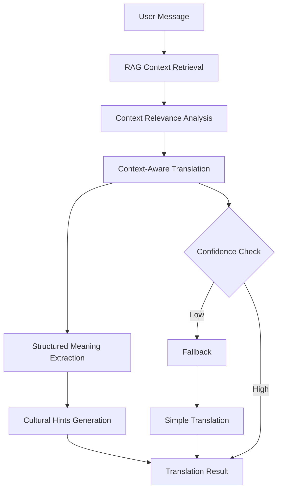

# 🧠 RAG Translation System Documentation

## Overview

The RAG (Retrieval-Augmented Generation) Translation System is an intelligent multilingual translation agent that provides context-aware, culturally accurate translations using conversation history and semantic understanding.

## Core Capabilities

### 1. Context-Aware Translation
- Uses retrieved conversation snippets to interpret ambiguous messages
- Maintains semantic continuity across conversation turns
- Disambiguates idioms, slang, and figurative expressions based on context

### 2. Structured Meaning Extraction
Along with translations, the system extracts structured data:
```json
{
  "translation": "translated text",
  "intelligent_processing": {
    "intent": "string",
    "tone": "string", 
    "topic": "string",
    "entities": ["string"],
    "language_detected": "string",
    "confidence": 0.85
  }
}
```

### 3. Cultural Context Detection
- Identifies slang, idioms, and cultural references
- Provides explanations for cultural nuances
- Maintains tone and emotional intent across languages

### 4. Memory & State Management
- Uses conversation history for semantic continuity
- Maintains consistent terminology across turns
- Handles context switching gracefully

## Architecture

### Core Services

#### 1. RAGTranslationService (`src/services/ragTranslation.ts`)
- Main RAG-based translation engine
- Context analysis and relevance extraction
- Structured meaning extraction
- Cultural hints generation

#### 2. EnhancedTranslationService (`src/services/enhancedTranslation.ts`)
- Integration layer between RAG and existing translation systems
- Intelligent routing between translation methods
- Fallback mechanisms
- Performance optimization

#### 3. SimpleTranslationService (Enhanced)
- Updated to support RAG context
- Seamless fallback when RAG is unavailable
- Maintains backward compatibility

### Data Flow



## Usage Examples

### Basic Translation with Context

```typescript
import { ragTranslationService } from './services/ragTranslation';

const result = await ragTranslationService.translateWithRAG(
  "Did you hear what happened with Alex?",
  {
    messages: [
      "Alex has been acting weird lately",
      "Someone spilled the tea about the breakup"
    ]
  },
  {
    target_language: 'ZH',
    tone: 'casual',
    context_awareness: true,
    cultural_hints: true
  }
);
```

### Enhanced Translation with Fallback

```typescript
import { enhancedTranslationService } from './services/enhancedTranslation';

const result = await enhancedTranslationService.translateMessage(
  message,
  'ZH',
  {
    useRAG: true,
    useCulturalHints: true,
    useSimpleTranslation: true,
    confidenceThreshold: 0.7
  }
);
```

## Context Scenarios

### 1. Social Gossip Context
**Input**: "Did you hear what happened with Alex?"
**Context**: ["Someone spilled the tea about the breakup"]
**Translation**: "你听说亚历克斯发生什么事了吗？"
**Intent**: gossip
**Cultural Hint**: "spilled the tea" = "泄露秘密"

### 2. Coffee Shop Context  
**Input**: "The customer got so angry yesterday."
**Context**: ["The customer spilled the tea on the counter"]
**Translation**: "昨天顾客非常生气。"
**Intent**: complaint
**Cultural Hint**: "spilled the tea" = "把茶打翻了"

### 3. Technical Discussion
**Input**: "The build is broken again."
**Context**: ["We're having issues with the CI/CD pipeline"]
**Translation**: "La compilación está rota otra vez."
**Intent**: technical_issue
**Tone**: professional

## API Reference

### RAGTranslationService

#### `translateWithRAG(userMessage, ragContext, userPreferences)`
- **userMessage**: string - Message to translate
- **ragContext**: RAGContext - Conversation context
- **userPreferences**: UserPreferences - Translation preferences
- **Returns**: RAGTranslationResult

#### `storeConversationContext(chatId, messages, metadata)`
- Stores conversation context for future RAG retrieval
- **chatId**: string - Chat identifier
- **messages**: string[] - Conversation messages
- **metadata**: any - Additional context metadata

#### `retrieveConversationContext(chatId, query, limit)`
- Retrieves relevant conversation context
- **chatId**: string - Chat identifier  
- **query**: string - Search query
- **limit**: number - Maximum results
- **Returns**: RAGContext

### EnhancedTranslationService

#### `translateMessage(message, targetLanguage, options)`
- Main translation method with intelligent routing
- **message**: Message - Message object
- **targetLanguage**: string - Target language code
- **options**: EnhancedTranslationOptions - Translation options
- **Returns**: EnhancedTranslationResult

#### `translateVoiceMessage(message, targetLanguage, options)`
- Translate voice messages with transcription
- **message**: Message - Voice message object
- **targetLanguage**: string - Target language code
- **options**: EnhancedTranslationOptions - Translation options
- **Returns**: EnhancedTranslationResult

## Configuration

### Environment Variables
```bash
EXPO_PUBLIC_OPENAI_API_KEY=your_openai_api_key
EXPO_PUBLIC_SUPABASE_URL=your_supabase_url
EXPO_PUBLIC_SUPABASE_ANON_KEY=your_supabase_key
```

### Translation Options
```typescript
interface EnhancedTranslationOptions {
  useRAG?: boolean;                    // Enable RAG translation
  useCulturalHints?: boolean;          // Enable cultural hints
  useSimpleTranslation?: boolean;      // Enable simple translation fallback
  contextLimit?: number;               // Maximum context messages
  confidenceThreshold?: number;        // Minimum confidence for RAG
}
```

## Error Handling

### Fallback Strategy
1. **RAG Translation** (Primary)
   - Context-aware translation with semantic understanding
   - High accuracy for conversational context

2. **Simple Translation** (Fallback)
   - Basic OpenAI translation without context
   - Reliable but less contextually accurate

3. **Fallback Translation** (Emergency)
   - Returns original text if all methods fail
   - Ensures system never breaks

### Error Types
- **API Errors**: OpenAI API failures
- **Context Errors**: RAG context retrieval failures  
- **Parsing Errors**: Invalid JSON responses
- **Network Errors**: Connection issues

## Performance Considerations

### Caching Strategy
- **Memory Cache**: In-memory caching for recent translations
- **SQLite Cache**: Persistent caching for cultural hints
- **Context Cache**: Conversation context caching

### Optimization
- **Batch Processing**: Multiple translations in single request
- **Lazy Loading**: Load context only when needed
- **Confidence Thresholds**: Skip RAG for low-confidence scenarios

## Testing

### Demo Component
The `RAGTranslationDemo` component provides an interactive interface for testing:
- Context management
- Translation testing
- Cultural hints display
- Performance monitoring

### Example Scenarios
The `ragTranslationExamples.ts` file contains comprehensive test cases:
- Social gossip context
- Coffee shop scenarios
- Technical discussions
- Idiom translations
- Slang detection
- Business contexts
- Emotional expressions
- Cultural references
- Sarcasm detection
- Multilingual scenarios

## Integration with MessageAI

### Existing Translation System
The RAG system integrates seamlessly with the existing MessageAI translation infrastructure:

1. **Backward Compatibility**: Existing translation calls continue to work
2. **Enhanced Features**: New RAG capabilities are opt-in
3. **Fallback Support**: Graceful degradation when RAG is unavailable
4. **Performance**: No impact on existing translation performance

### Message Flow Integration
```
User Message → RAG Context Analysis → Enhanced Translation → UI Display
     ↓              ↓                      ↓
Simple Translation ← Fallback ← Error Handling
```

## Future Enhancements

### Planned Features
1. **Supabase Vector Integration**: Full vector database support
2. **Real-time Context**: Live conversation context updates
3. **Multi-language Context**: Cross-language context understanding
4. **Advanced Analytics**: Translation quality metrics
5. **Custom Models**: Fine-tuned models for specific domains

### Performance Improvements
1. **Streaming Translation**: Real-time translation streaming
2. **Edge Caching**: CDN-based translation caching
3. **Model Optimization**: Smaller, faster models for mobile
4. **Batch Processing**: Bulk translation operations

## Troubleshooting

### Common Issues

#### 1. Low Translation Quality
- **Cause**: Insufficient context or low confidence
- **Solution**: Increase context limit or lower confidence threshold

#### 2. Slow Performance
- **Cause**: Large context or network issues
- **Solution**: Reduce context limit or enable caching

#### 3. Missing Cultural Hints
- **Cause**: Cultural hints disabled or API issues
- **Solution**: Enable cultural hints or check API configuration

#### 4. Context Not Used
- **Cause**: RAG disabled or context empty
- **Solution**: Enable RAG or provide conversation context

### Debug Mode
Enable debug logging to troubleshoot issues:
```typescript
// Enable debug logging
console.log('RAG Translation Debug:', {
  userMessage,
  ragContext,
  result,
  method: result.method,
  confidence: result.intelligentProcessing?.confidence
});
```

## Contributing

### Development Setup
1. Install dependencies: `npm install`
2. Configure environment variables
3. Run demo: `npx expo start`
4. Test with RAGTranslationDemo component

### Adding New Features
1. Update service interfaces
2. Add comprehensive tests
3. Update documentation
4. Test with example scenarios

### Code Style
- TypeScript for type safety
- Comprehensive error handling
- Clear documentation
- Performance optimization
- Backward compatibility

## License

This RAG Translation System is part of the MessageAI project and follows the same licensing terms.
